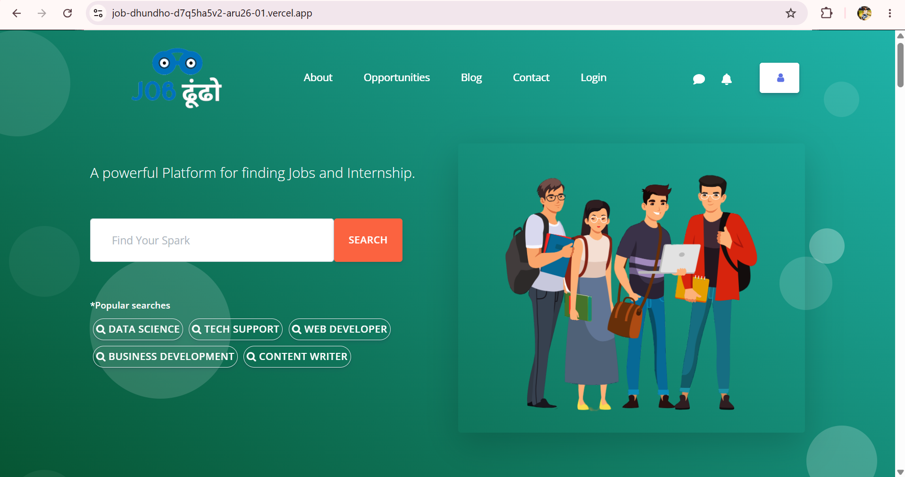

# Job-Dhundho

🚀 **[Live demo →](https://job-dhundho-aru26-01.vercel.app/)**

A React job application portal with a modern, interactive UI for browsing and applying to roles. Built around a clean search experience with popular category quick-links and a clean login flow.



## Features
- Job and internship search with category filters
- Login / sign-up flow
- Responsive landing page with About, Opportunities, Blog, Contact navigation
- Modern, illustration-led UI design

## Tech stack
React · JavaScript · HTML · CSS · Bootstrap

## Run locally

```bash
git clone https://github.com/aru2601/job-dhundho.git
cd job-dhundho
npm install
npm start
```

The app opens at http://localhost:3000.

## Deployment
Continuously deployed to Vercel — every push to `main` triggers a fresh build.

---
*Built during my time as Associate Software Engineer (Nov 2022 – Dec 2024). Now part of my portfolio while I transition into data science / ML roles — see also [FakeBusterReviewAI](https://github.com/aru2601/FakeBusterReviewAI).*